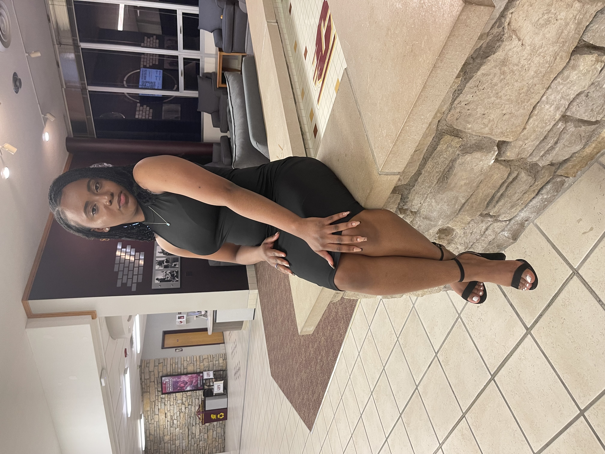

# 💡 Suggestions to Make It Even Better

**Current Status:** Already great! But here are ways to elevate it further.

---

## 🎬 **1. Add Subtitles/Captions to Videos (High Impact)**

**Why:**
- She can watch even in a noisy place
- More accessible
- More emotional when she reads what you're saying
- Professional film quality

**How:**
Use a tool like [Rev.com](https://rev.com) (paid, $1.50/min) or [Kapwing](https://kapwing.com) (free):
1. Upload each video
2. Auto-generate subtitles
3. Style them (white text, black background, bottom center)
4. Export with captions burned in
5. Replace the video files

**Result:** Videos feel more polished and she won't miss a word.

---

## 🎵 **2. Add Background Music (Low, Subtle)**

**Why:**
- Creates emotion
- Fills silence during letter reading
- Makes it feel more "produced"
- Cinematic atmosphere

**How:**
Pick **one** instrumental track (no lyrics):
- [Epidemic Sound](https://epidemicsound.com) - license-free
- Or search "emotional piano instrumental no copyright" on YouTube

**Where to add it:**
```javascript
// In script.js
const bgMusic = new Audio('music/background.mp3');
bgMusic.volume = 0.15; // Very low
bgMusic.loop = true;

// Start when they scroll past hero
window.addEventListener('scroll', () => {
    if (window.scrollY > 100) {
        bgMusic.play();
    }
}, { once: true });
```

**Important:** Volume should be 15-20% max. Should feel like it's there, not overpower.

---

## 📱 **3. Make It a PWA (Progressive Web App)**

**Why:**
- She can "install" it on her phone
- Works offline after first visit
- Icon on her home screen
- Feels like an app, not just a website

**How:**
Create `manifest.json`:
```json
{
  "name": "For Adufe",
  "short_name": "Adufe",
  "start_url": "/",
  "display": "standalone",
  "background_color": "#000000",
  "theme_color": "#B8860B",
  "icons": [
    {
      "src": "icon.png",
      "sizes": "512x512",
      "type": "image/png"
    }
  ]
}
```

Add to `<head>`:
```html
<link rel="manifest" href="manifest.json">
<meta name="theme-color" content="#000000">
```

**Result:** She can save it to her phone home screen with a custom icon.

---

## 🎨 **4. Add Date/Location Labels to Memories**

**Why:**
- Makes memories more meaningful
- "Remember when we..." context
- Shows you remember details

**How:**
Update carousel cards:
```html
<div class="card" data-type="image" data-src="IMG_3787.jpeg">
    
    <div class="card__overlay">
        <span class="card__type">Photo</span>
        <span class="card__meta">December 2024 • Detroit</span>
    </div>
</div>
```

**Result:** Each memory has context ("Summer 2024 • Our first date").

---

## ✍️ **5. Add Handwritten Touch**

**Why:**
- More personal than typed text
- Shows extra effort
- Unique to you

**Options:**

### **Option A: Handwritten Signature**
- Write "Praise" on paper
- Take photo with good lighting
- Use [remove.bg](https://remove.bg) to remove background
- Add as PNG image at end of letter

### **Option B: Handwritten Notes on Photos**
- Use iPad/tablet to write on photos
- "This was the day..." notes
- Export and replace carousel images

**Result:** Feels more personal, less "website-y".

---

## 🎥 **6. Add a "From Praise" Video Intro**

**Why:**
- She hears your voice immediately
- More intimate than just text
- Sets the tone

**How:**
Record 15-30 second video:
- Face camera
- "Hey Adufe, I made this for you. Take your time with it. I love you."
- Keep it simple, honest
- Replace the current intro video OR add before the letter

**Result:** She feels like you're talking directly to her.

---

## 🌟 **7. Add Interactive Elements**

**Why:**
- Engagement
- Makes it memorable
- Fun surprise

**Ideas:**

### **Hidden Easter Eggs:**
- Click your name → secret message appears
- Konami code → special video unlocks
- Hover on certain words → they glow gold

### **"For You" Section:**
Add a section where she can leave her response:
```html
<textarea placeholder="Your thoughts..."></textarea>
<button>Save for later</button>
```
(Uses localStorage, stays on her device only)

**Result:** More interactive, less one-way.

---

## 📊 **8. Add Analytics (Optional, Respectful)**

**Why:**
- You'll know when she visited
- How long she stayed on each section
- If she watched all videos

**How:**
Use [Plausible](https://plausible.io) (privacy-focused, not creepy like Google Analytics):
- Shows page views
- No personal data tracked
- Just shows engagement

**Important:** Only if you're okay knowing. Don't obsess over it.

---

## 🔐 **9. Add Password Protection (If Sharing Link)**

**Why:**
- If you share the link publicly (social media, etc.)
- Keeps it private between you two
- More intimate

**How:**

**Option A: Simple JS Password:**
```javascript
const password = prompt("Enter password:");
if (password !== "adufe2026") {
    document.body.innerHTML = "<h1>Wrong password</h1>";
}
```

**Option B: Netlify Password Protection:**
- Netlify paid plan ($19/mo)
- Settings → Access Control → Password

**Result:** Only she (and people you give password to) can see it.

---

## 🎁 **10. Add a "Download Memories" Button**

**Why:**
- She can save the photos/videos
- Keeps them forever
- Thoughtful gesture

**How:**
Add button in memories section:
```html
<button class="download-btn">Download All Memories</button>
```

JavaScript to create zip file:
```javascript
// Use library like JSZip
// Package all photos/videos
// Download as "Our_Memories.zip"
```

**Result:** She has a copy of everything, not just the website.

---

## 🌈 **Quick Wins (5 Minutes Each):**

### **A. Add Loading Animation**
```css
.loading {
    position: fixed;
    inset: 0;
    background: black;
    display: flex;
    align-items: center;
    justify-content: center;
    z-index: 99999;
}

.loading__text {
    color: gold;
    font-size: 1.5rem;
    animation: pulse 1.5s infinite;
}
```

### **B. Add Smooth Cursor**
```css
* {
    cursor: url('data:image/svg+xml;utf8,<svg>...</svg>'), auto;
}
```
(Custom gold cursor)

### **C. Add Keyboard Shortcuts**
- Press `1-7` to jump to video chapters
- `Spacebar` to pause/play
- `Left/Right` arrows for carousel

---

## 🎯 **My Top 3 Recommendations:**

### **1. Add Subtitles to Videos** 🔥
**Impact:** High  
**Effort:** Medium (2 hours)  
**Why:** Makes everything clearer, more emotional, more professional

### **2. Add Date/Location to Memories** ⭐
**Impact:** High  
**Effort:** Low (30 minutes)  
**Why:** Makes memories more meaningful, shows you care about details

### **3. Add Background Music** 🎵
**Impact:** Medium-High  
**Effort:** Low (15 minutes)  
**Why:** Creates atmosphere, fills silence, feels more cinematic

---

## 🚫 **What NOT to Do:**

❌ **Don't add too much** - keep it simple  
❌ **Don't make it gamified** - this isn't a game  
❌ **Don't add ads/popups** - obvious  
❌ **Don't track her obsessively** - creepy  
❌ **Don't add countdown timers** - no pressure  

---

## 💭 **Optional: Add a "Why I Made This" Section**

Before the finale, add a short section:

```html
<section class="why">
    <div class="container container--narrow">
        <h2 class="title">Why I Made This</h2>
        <p>I wanted to show you, not just tell you. Words are easy. Actions take time. This is me taking time. For you.</p>
    </div>
</section>
```

**Result:** Explains the intention without being preachy.

---

## 🎬 **The "Next Level" Version (If You Have Time):**

### **Build a Timeline:**
Instead of just "Us" videos, make it a visual timeline:
- 2023: When we met
- 2024: Our journey
- 2025: The breakup
- 2026: Now (this site)

Each with photos/videos from that period.

**Result:** Tells the complete story, not just recent memories.

---

## 🧪 **Test These Before Sharing:**

- [ ] Videos play with sound
- [ ] Carousel scrolls smoothly
- [ ] Works on her phone type (iPhone? Android?)
- [ ] Looks good in both portrait and landscape
- [ ] No typos in the letter
- [ ] All videos load
- [ ] Lightbox works
- [ ] Share button creates proper link

---

## 📲 **When You Share:**

### **Don't just send the link:**

**Option 1: Voice Note**
"Hey, open this when you have time. It's not perfect, but it's honest. I love you."

**Option 2: In Person**
Hand her your phone with it open. Let her scroll through while you're there (but don't hover).

**Option 3: Thoughtful Text**
"I made something for you. No pressure. Take your time with it. [link]"

---

## 💜 **Bottom Line:**

**The site is already great.** These are just ideas to make it even more special.

**My advice:**
1. Add subtitles to videos (if you have time)
2. Add date/location to memories (quick, high impact)
3. Maybe add subtle background music (if it fits)

**Then leave it alone.** Don't keep tweaking. Share it when it feels right.

---

**The site is beautiful. The design is clean. The message is clear. The videos tell your story.**

**Now it's about the moment you share it, not the site itself.**

---

*Suggestions written: February 2, 2026*  
*Your call on what to add. Trust your instinct.* 🎯
